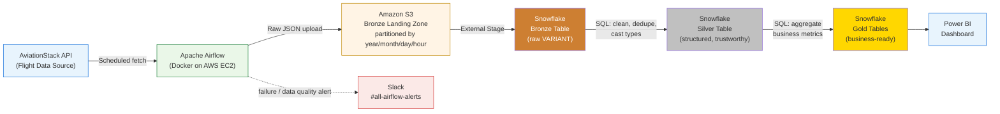
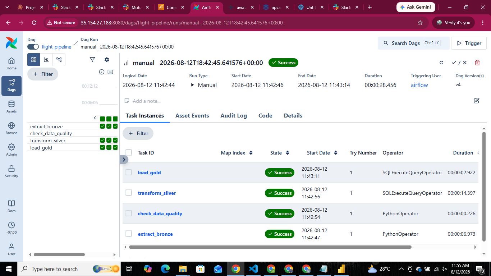
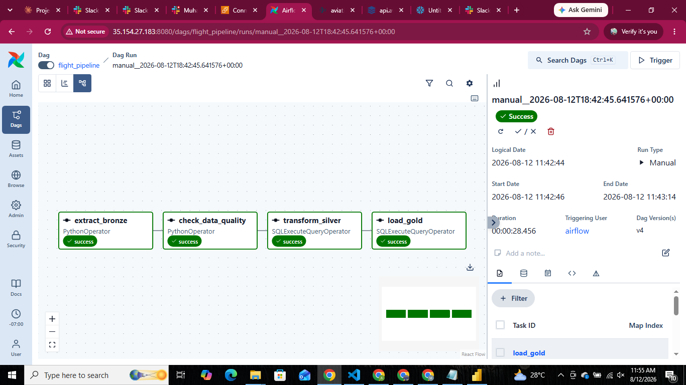
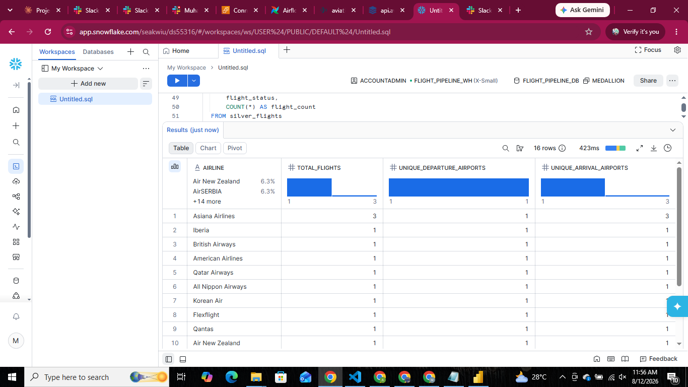
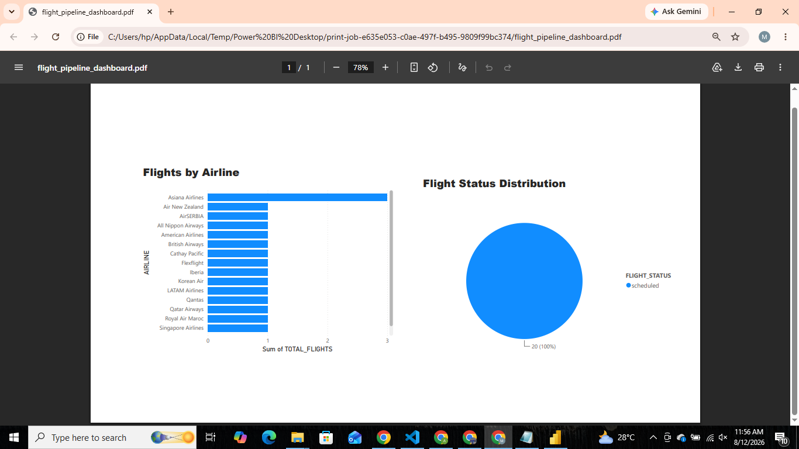
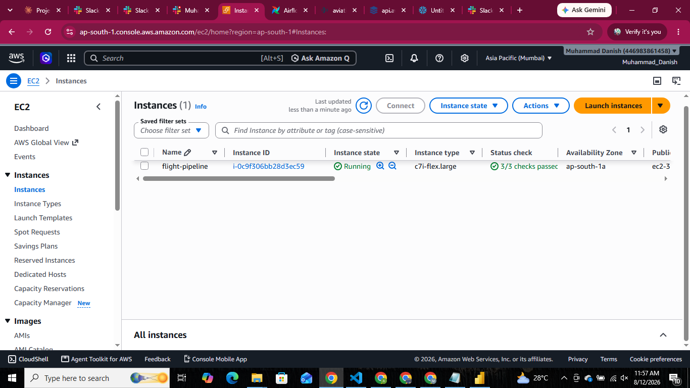

# ✈️ Flight Data Pipeline — Medallion Architecture

A real-time flight tracking data pipeline built with **Apache Airflow**, **AWS S3**, and **Snowflake**, following the **Medallion Architecture** pattern (Bronze → Silver → Gold). Business-ready data is visualized in **Power BI**, and pipeline health is monitored via **Slack alerts**.

> Originally designed around the OpenSky Network API, this project pivoted to the **AviationStack API** after discovering OpenSky blocks all AWS/GCP/Azure hyperscaler IP ranges to prevent bot abuse — a real-world lesson in adapting data-source strategy mid-project.

---

## 🏗️ Architecture


---

## 📸 Screenshots

### Airflow DAG — successful end-to-end run (list view)


### Airflow DAG — graph view (all 4 tasks green)


### Snowflake — Gold layer aggregation


### Power BI Dashboard


### AWS EC2 — running instance


---

**Bronze → Silver → Gold**, explained simply:
- 🥉 **Bronze (Raw):** Data exactly as it arrived — untouched, messy, kept as the source of truth.
- 🥈 **Silver (Cleaned):** Nulls handled, duplicates removed, types corrected. Trustworthy, not yet business-friendly.
- 🥇 **Gold (Business-Ready):** Aggregated and shaped for dashboards — what business users actually see.

---

## 🧰 Tech Stack

| Layer | Technology |
|---|---|
| Orchestration | Apache Airflow (CeleryExecutor, Docker Compose) |
| Compute | AWS EC2 (Ubuntu 24.04, Mumbai `ap-south-1`) |
| Raw storage | Amazon S3 (partitioned Bronze landing zone) |
| Warehouse | Snowflake (Bronze / Silver / Gold layers, SQL transformations) |
| Data source | AviationStack API |
| Visualization | Power BI |
| Monitoring | Slack webhook alerts + automated data-quality checks |

---

## 📂 Repository Structure
flight-pipeline/
├── dags/
│ └── flight_pipeline_dag.py # Airflow DAG: extract → quality check → silver → gold
├── docker-compose.yaml # Airflow + Postgres + Redis services
├── .env.example # Template for required environment variables
├── .gitignore
├── sql/
│ ├── bronze_setup.sql # Snowflake stage + bronze table
│ ├── silver_transform.sql # Silver layer transformation
│ └── gold_aggregations.sql # Gold layer business tables
├── screenshots/
│ ├── airflow-dag-list.png
│ ├── airflow-dag-graph.png
│ ├── snowflake-gold-table.png
│ ├── powerbi-dashboard.png
│ └── ec2-instance.png
└── README.md
---

## ⚙️ Pipeline Flow

1. **Extract (Bronze)** — Airflow's `extract_bronze` task calls the AviationStack API on a schedule, saves the raw JSON response, and uploads it to S3 under a date/hour-partitioned path:
s3://<bucket>/bronze/year=YYYY/month=MM/day=DD/hour=HH/flights_<timestamp>.json
2. **Data Quality Check** — `check_data_quality` task verifies the API response contained records; if zero records are returned, the task fails and triggers a Slack alert.
3. **Transform (Silver)** — A Snowflake SQL task flattens and cleans the raw JSON into a structured, deduplicated `silver_flights` table.
4. **Aggregate (Gold)** — A second Snowflake SQL task builds business-ready summary tables: `gold_airline_summary` and `gold_status_summary`.
5. **Visualize** — Power BI connects directly to the Snowflake Gold layer for live dashboards.
6. **Monitor** — Any task failure across the DAG triggers a Slack notification via webhook, including the failed task name and a direct link to logs.


## 🚀 Setup

### Prerequisites
- AWS account (EC2 + S3)
- Snowflake account
- AviationStack API key ([free tier](https://aviationstack.com/signup/free), 100 requests/month)
- Slack workspace (for alerts, optional)

### 1. Clone and configure
```bash
git clone https://github.com/Muhammad-Danish-Abbas/EC2_Airflow_Project.git
cd EC2_Airflow_Project
cp .env.example .env
# Edit .env with your own credentials
```

### 2. Launch Airflow
```bash
docker compose up airflow-init
docker compose up -d
```
Airflow UI available at `http://<your-ec2-ip>:8080`

### 3. Set up Snowflake
Run the scripts in `sql/` in order: `bronze_setup.sql` first, then `silver_transform.sql` and `gold_aggregations.sql` (the DAG runs the latter two automatically on each run).

### 4. Configure Airflow connections
In **Admin → Connections**, add a Snowflake connection (`snowflake_conn`) with your account, warehouse, database, and credentials.

### 5. Trigger the DAG
Unpause `flight_pipeline` in the Airflow UI, or trigger manually to test.

---

## 🔐 Environment Variables (`.env`)

| Variable | Description |
|---|---|
| `AIRFLOW_UID` | Host user ID (for file permissions) |
| `AVIATIONSTACK_API_KEY` | AviationStack API key |
| `SLACK_WEBHOOK_URL` | Slack incoming webhook for failure alerts |
| `_PIP_ADDITIONAL_REQUIREMENTS` | Extra Python packages (`pandas requests apache-airflow-providers-snowflake`) |

> ⚠️ Never commit your real `.env` file. Use `.env.example` as a template.

---

## 💡 Key Design Decisions

- **AWS-blocked source → pivoted data provider:** OpenSky Network blocks all major cloud-hyperscaler IP ranges. Rather than fighting the block, the pipeline was rebuilt around AviationStack — a decision documented as part of the engineering process, not hidden.
- **SQL-first Silver/Gold layers:** Transformations were deliberately kept in Snowflake SQL (not Python/pandas) so the warehouse remains the single source of transformation logic — easier to audit, version, and hand off to analysts.
- **Partitioned Bronze storage:** S3 keys are partitioned by `year/month/day/hour` to keep both cost and query performance manageable as the archive grows.
- **Fail loud, alert fast:** A dedicated data-quality task plus a DAG-wide `on_failure_callback` means silent failures (e.g., an API returning 0 records) surface immediately in Slack.

---

## 📊 Business Value

- **Faster decisions** — live dashboards instead of manual data pulls.
- **Lower risk from bad data** — raw Bronze data is immutable; transformation logic can always be re-run.
- **Reusability** — multiple dashboards can be built on the same Gold layer without rebuilding ingestion.
- **Auditability** — any number on a dashboard can be traced back to its original raw API response.

---

## 📄 License

This project is for educational/portfolio purposes.
